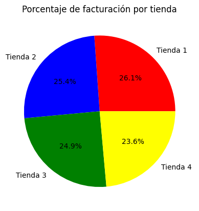
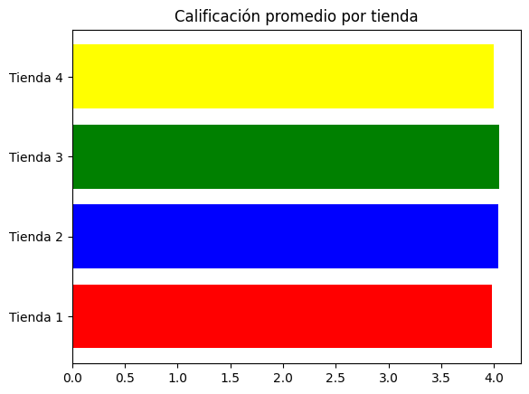
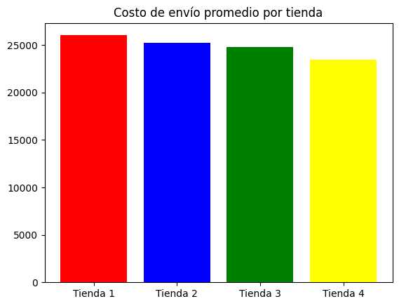

# Alura_Store
# 🧠 Análisis de Desempeño de Tiendas con Python

Este proyecto tiene como objetivo aplicar herramientas de análisis de datos en Python para evaluar el desempeño de cuatro tiendas y **tomar una decisión informada sobre cuál cerrar**, con el fin de redirigir la inversión a un negocio más rentable.

---

## 📊 Indicadores Analizados

A continuación se describen los cinco principales indicadores que se evaluaron:

### 🔹 1. Facturación Total

| Tienda   | Facturación Total ($)     |
|----------|----------------------------|
| Tienda 1 | 1,150,880,400.00           |
| Tienda 2 | 1,116,343,500.00           |
| Tienda 3 | 1,098,019,600.00           |
| Tienda 4 | 1,038,375,700.00           |

**Análisis:**  
La **Tienda 4** tuvo la **facturación más baja**, lo que refleja una menor capacidad de generar ingresos frente a sus competidoras. Esta **diferencia de más de $112 millones frente a la tienda líder** es significativa y preocupante desde una perspectiva financiera.

---

### 🔹 2. Categorías de Productos Más Vendidas

Todas las tiendas comparten un patrón de consumo similar: **Muebles**, **Electrónicos** y **Juguetes** son las categorías más vendidas.

| Tienda   | Categoría más vendida | Unidades |
|----------|------------------------|----------|
| Tienda 1 | Muebles                | 465      |
| Tienda 2 | Muebles                | 442      |
| **Tienda 3** | **Muebles**       | **499**  |
| Tienda 4 | Juguetes               | 338      |

**Análisis:**  
Aunque la Tienda 4 lidera en una categoría puntual (Juguetes), sus buenos resultados en unidades vendidas no se traducen en una facturación elevada. Esto sugiere que vende productos de menor valor o con márgenes más bajos, lo cual impacta negativamente su rentabilidad.

---

### 🔹 3. Calificaciones Promedio de Clientes

| Tienda   | Calificación promedio |
|----------|------------------------|
| Tienda 3 | ⭐ 4.05                 |
| Tienda 2 | ⭐ 4.04                 |
| Tienda 4 | ⭐ 4.00                 |
| Tienda 1 | ⭐ 3.98                 |

**Análisis:**  
La Tienda 4 mantiene una calificación aceptable, aunque no logra sobresalir. Tienda 3 obtiene la mejor valoración por parte de los clientes, lo que podría relacionarse con una mejor experiencia de compra. En contraste, Tienda 1, a pesar de tener la mayor facturación, presenta la calificación más baja.

---

### 🔹 4. Productos con Mayor y Menor Rotación

| Producto                 | T1 | T2 | T3 | T4 |
|--------------------------|----|----|----|----|
| Armario                  | 60 | 54 | 49 | **34** |
| Bloques de construcción  | 56 | 54 | 35 | 54 |
| Asistente virtual        | 40 | 38 | 39 | **50** |

**Análisis:**  
La rotación de productos refleja qué tan bien se están vendiendo los artículos específicos. Tienda 4 presenta un comportamiento inconsistente: aunque destaca en productos como "Asistente virtual", tiene los peores resultados en otros esenciales como "Armario". Esto puede indicar debilidades en la selección o gestión del inventario.

---

### 🔹 5. Costos Logísticos (Promedio de Envío)
| Tienda   | Costo Logístico promedio ($) |
|----------|-----------------------------|
| Tienda 1 | 26,018.61                   |
| Tienda 2 | 25,216.24                   |
| Tienda 3 | 24,805.68                   |
| Tienda 4 | 23,459.46                   |

**Análisis:**  
Aunque la Tienda 4 muestra el menor costo logístico, esto no compensa su bajo rendimiento general. Un menor costo puede deberse a una menor cobertura, menor volumen de pedidos o una estructura logística limitada, lo que podría ser un síntoma más que una ventaja.

---

## ✅ Conclusión y Recomendación Final

Tras el análisis integral, se concluye que **la Tienda 4 es la menos rentable y competitiva** del grupo.

### 🔻 Principales razones para cerrar la Tienda 4:

- **Facturación más baja** entre las cuatro tiendas.
- **Desempeño irregular** en la rotación de productos clave.
- No destaca en **satisfacción del cliente**.
- Aunque tiene **costos logísticos bajos**, esto no se refleja en una mejor rentabilidad general.

### 💡 Recomendación:

Se recomienda cerrar la **Tienda 4** y redirigir los recursos hacia las tiendas con mejor desempeño o nuevos proyectos con mayor potencial de crecimiento y retorno de inversión.

